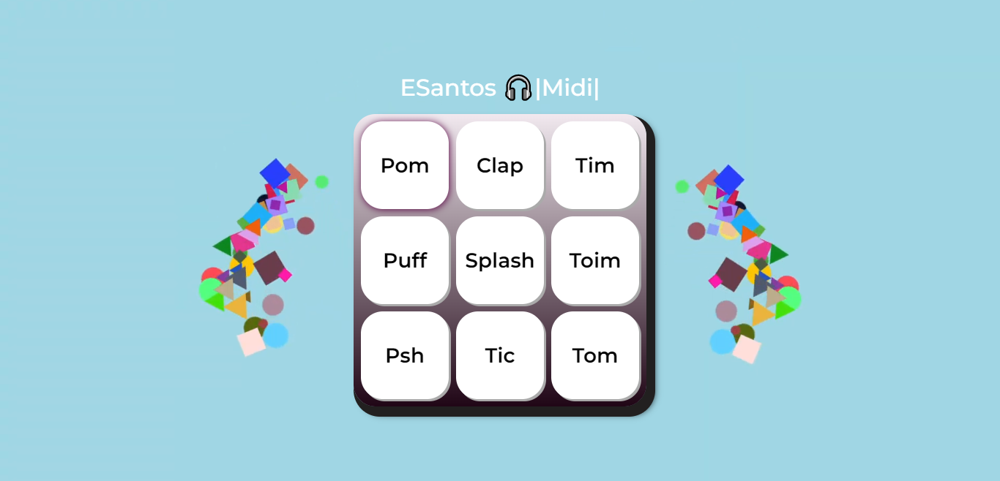

ESantos 🎧|MIDI|
# JavaScript para Web: Crie páginas dinâmicas - ALURA

    
 

Este projeto foi desenvolvido como parte do curso de **JavaScript para WEB** da Alura. Ele inclui exemplos de uso de:

- Funções
- Listas
- Iterando em listas
- Eventos
- Lógica em JavaScript

O projeto inclui exemplos de como usar esses tópicos para criar um site dinâmico e interativo. Você pode explorar o código-fonte para entender como os diferentes elementos funcionam juntos para criar a experiência do usuário final.
